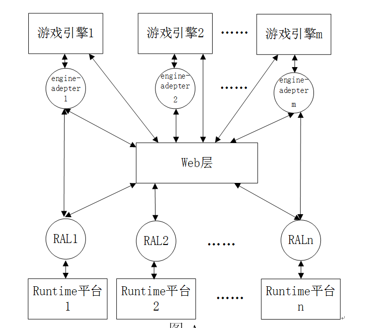
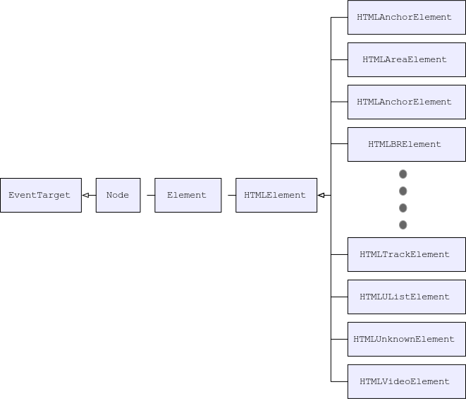

# runtime-web-adapter

## 设计目标

Runtime 可以运行 H5 格式的小游戏。

## 需求分析

- 兼容不同渠道、不同版本的 Runtime APIs
- 能够提供不同游戏引擎依赖的特性 APIs
- 能够提供标准的 WEB APIs

## 概要设计

### Overview



### 职责说明

#### RAL 层

基于不同渠道、不同版本的 Runtime APIs，实现稳定的行为一致的 APIs，具体参考文档 `ral/API.md`。

#### WEB 层

基于 RAL 层提供的稳定 APIs，根据 WEB 标准 [Web APIs](https://developer.mozilla.org/en-US/docs/Web/API) 实现游戏引擎依赖的部分 WEB APIs。

其中 HTML 元素类的整体继承如下所示：



#### engine-adapter 层

基于 RAL 层提供的稳定 APIs 和 WEB 层提供的标准 APIs，实现不同游戏引擎依赖的特性 APIs。

## 使用说明

最终输出物为 web-adapter&#91;.min&#93;js、ral&#91;.min&#93;.js 及 &#91;engine name&#93;-adapter&#91;.min&#93;.js，带 .min 为混淆后的文件。

可以将三个 JS 文件放入小游戏输出物包中并在小游戏的入口文件中增加如下代码：

```javascript
require("ral[.min].js");
require("web-adapter[.min].js");
require("[engine name]-adapter[.min].js");
```

也可以仅将 web-adapter&#91;.min&#93;js 和 ral&#91;.min&#93;.js 这两个 JS 文件放入小游戏输出物包中并在小游戏的入口文件中增加如下代码：

```javascript
require("ral[.min].js");
require("web-adapter[.min].js");
```
